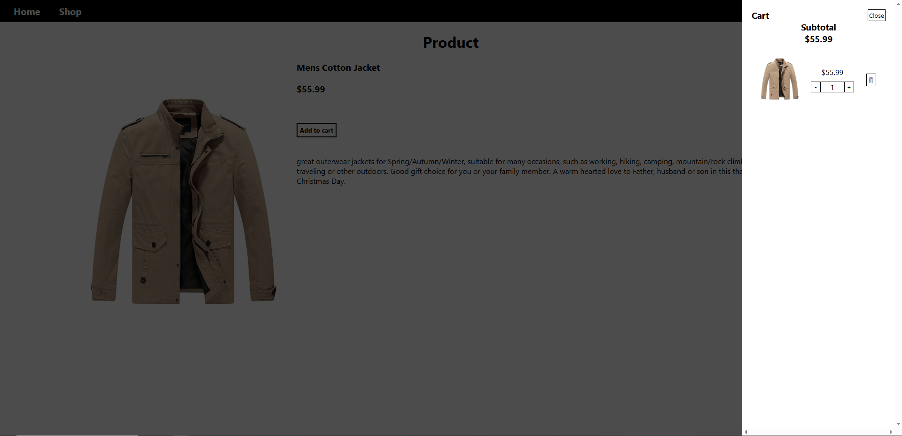

# The Online Shop

## Description

The Online Shop captures customer’s demand for each product and displays it in a virtual shopping cart. Customers can also update the quantity of each product after adding it to the cart. This project serves to give a visual representation of backend data, that is transmitted through API. I used [FakeStore API](https://fakestoreapi.com/) in this project.  

Using the web development skills that I learned from [The Odin Project](https://www.theodinproject.com/
), the mundane server-side data is transformed into HTML elements that users can interact with, with a click of a button.

## Features

- Single-page application
- Type checking
- Modular web components
- React portals

## Installation

1. **Fork the Repository**

    - Follow the documentation on GitHub to [fork this repository](https://docs.github.com/en/pull-requests/collaborating-with-pull-requests/working-with-forks/fork-a-repo).  

    - You should also have a local clone of the forked repository after following the tutorial.

2. **Move to the cloned directory**

    ``cd shopping-cart``

3. **Install Dependencies**

    ``npm install``

4. **Start the project**

    ``npm run dev``

## Contribute

- Issue Tracker: github.com/jayyzzeezzy/shopping-cart/issues
- Source Code: github.com/jayyzzeezzy/shopping-cart.git

## Support

Let me know if you encounter any issues.  
Email me at: <jam9es@gmail.com>

## License

The project is licensed under the [MIT license](LICENSE.md).
